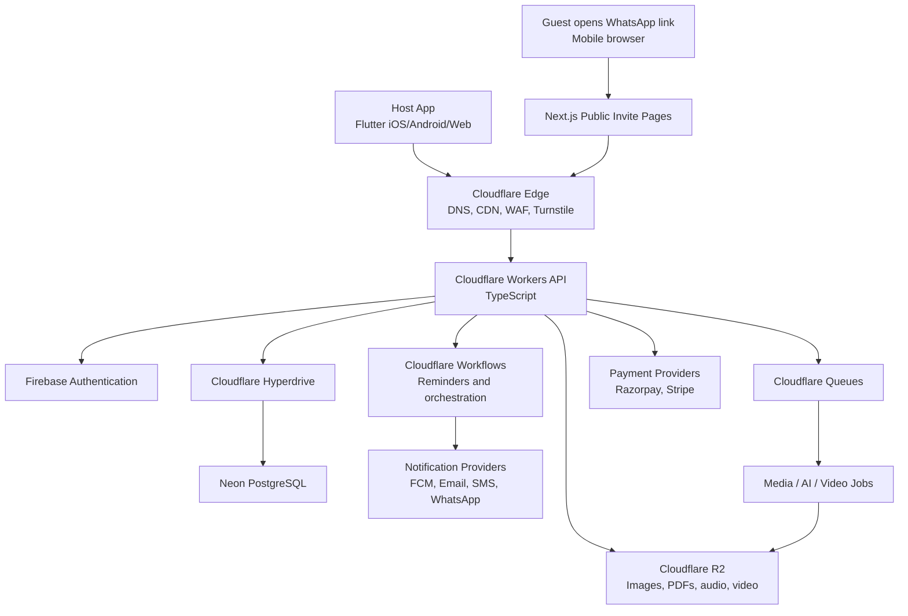

# Architecture Diagram


```mermaid
flowchart TD
  Host["Host App<br/>Flutter iOS/Android/Web"] --> Edge["Cloudflare Edge<br/>DNS, CDN, WAF, Turnstile"]
  Guest["Guest opens WhatsApp link<br/>Mobile browser"] --> PublicWeb["Next.js Public Invite Pages"]
  PublicWeb --> Edge
  Edge --> API["Cloudflare Workers API<br/>TypeScript"]
  API --> Auth["Firebase Authentication"]
  API --> Hyperdrive["Cloudflare Hyperdrive"]
  Hyperdrive --> Postgres["Neon PostgreSQL"]
  API --> R2["Cloudflare R2<br/>Images, PDFs, audio, video"]
  API --> Queues["Cloudflare Queues"]
  API --> Workflows["Cloudflare Workflows<br/>Reminders and orchestration"]
  Workflows --> Notifications["Notification Providers<br/>FCM, Email, SMS, WhatsApp"]
  Queues --> MediaJobs["Media / AI / Video Jobs"]
  MediaJobs --> R2
  API --> Payments["Payment Providers<br/>Razorpay, Stripe"]
```

## Key Flow

```text
Create event -> publish invite -> share WhatsApp link -> guest opens web page
-> RSVP -> add calendar/reminder -> host sees response
```
